  
  
  
  
  

<!-- Animated Typing Banner -->

  

  

---

<!-- Music "Now Playing" block -->

  🎶 <b>Now Playing:</b> <i>"First Name, Last Frame"</i> — singing the story of my life  
   
  ▁ ▂ ▃ ▄ ▅ ▆ ▇ █   ▁ ▂ ▃ ▄ ▅ ▆ ▇ █   ▁ ▂ ▃ ▄ ▅ ▆ ▇ █

<!-- Running music notes animation -->
<!-- Music notes strip (text-based, works everywhere) -->

  
    ♪ ♫ ♬ ♫ ♪ &nbsp;&nbsp; ♪ ♫ ♬ ♫ ♪ &nbsp;&nbsp; ♪ ♫ ♬ ♫ ♪
  

---

## 🌐 Connect with Me

<!-- Icon row -->

  
  &nbsp;&nbsp;
  
  &nbsp;&nbsp;
  

<!-- Pill-style link row -->

  
  
  

---

## 👋 About Me

- 🎓 **Virginia Tech '27** · Data Science / CS, focused on **NLP & LLMs**  
- 🎵 I build **AI music videos** and interactive experiences  
- 📊 **Data magician:** turning silent numbers → voices in stories you can feel  
- ❤️ I genuinely **love storytelling** – in code, visuals, and music  
- ✈️ *“I am willing to travel across the world to do wonderful things.”*  

---

## 🔭 What I’m Working On

- 🤖 **LLM & NLP Research**  
- 🎨 **AI Music & Art** 
- 💼 **Side Hustle Projects** [Devpost](https://devpost.com/stephenallstar24)  

---

## 🎼 Music-Coded Tech Stack

### 🎹 Instruments — Programming Languages

 

### 🎛️ Synths & Plugins — Frameworks & Libraries

 

 

 

### 🎚️ Studio Gear — Technologies & Tools

 

 

 

 

---

## 💼 Experience

  <!-- Marriott -->
  
   

  <!-- Virginia Tech -->
  
   

  <!-- FPT Software -->
  

- 🏨 **Marriott International** – Software Engineer & Software Quality Engineer Intern  
  - Mobile App Team 

- 🎓 **Virginia Tech** – Undergraduate Research Assistant & Mentor  
  - Search-augmented LLMs with **Dr. Tu Vu** · Co-author on *SealQA: Raising the Bar for Reasoning in Search-Augmented LMs*  
  - Mentor for CMDA 1634 · Data science & computational modeling

- 🎨 **FPT Software (AI Artist Team)** – Artificial Intelligence Engineer Intern  
  - NLP, Generative AI, LLMs, CV, GANs, transformers, Azure · AI-generated art & media (“Deep Peace of Art”, etc.)
---

## 📊 Contribution Activity

  

---

🎵🎧 *Thanks for stopping by.*  
 
If you’re into **NLP, LLMs, AI music, or wild data ideas**,  
 
<b>let’s jam on something together.</b> 🎼

<!-- Bottom Wave Banner -->

